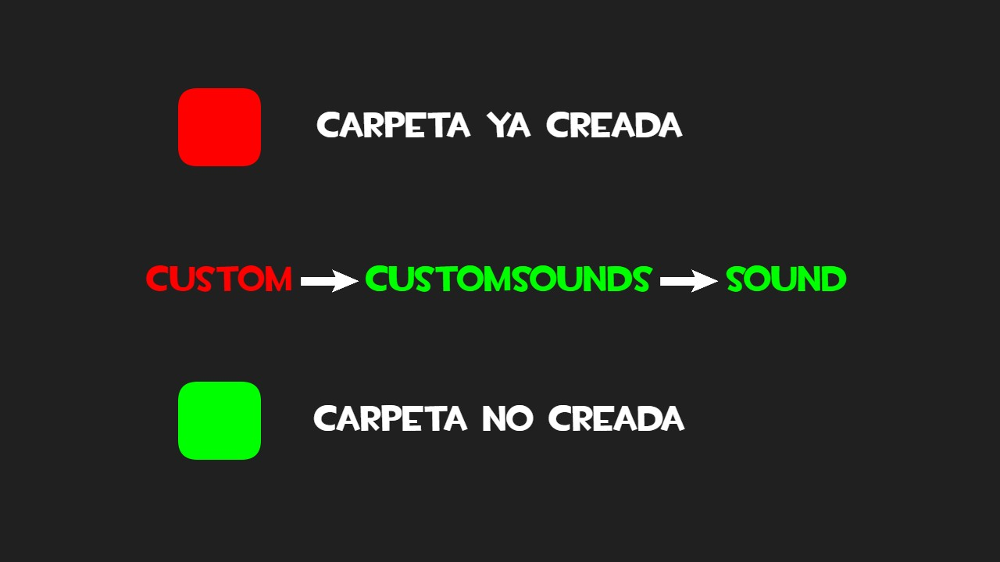

# Voces Modificadas TF2: Engineer

Paquete de voces modificadas del Ingeniero del juego Team Fortress 2, creadas por Dogecito42.
Modifican el juego base añadiendo un amplio repertorio de voces customizadas en español

https://github.com/user-attachments/assets/299a0f3d-4400-4564-87b1-e2af3843aebb

# Contenido

Este paquete incluye:

- Lineas de comando de voz del Ingeniero
- Lineas de dominación y de acción del Ingeniero
- Lineas de dolor y dolor crítico del Ingeniero
- Lineas del Scream Fortress del Ingeniero
- Lineas de Mann VS Machine 

# Uso

Situándose en SteamLibrary\steamapps\common\Team Fortress 2\tf , crea las carpetas señaladas en la localización que se muestra en la imagen. Desde ahí solo pega la carpeta e inicia el juego 

